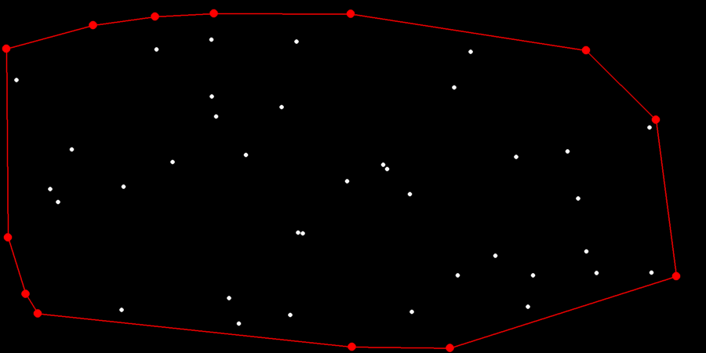

# Convex Hull

A Convex Hull contains all points and the connections between them.

[Wikipedia](https://en.wikipedia.org/wiki/Convex_hull)

## Gift Wrapping Algorithm
To find the Convex Hull of a given list of points, we need to find the most left point first. From this point we look at all other points and find the one that is the most left (or right if you want to go the other way around). After we found the most left point we repeat until we are back at the first point in the Hull (hull[0]).

